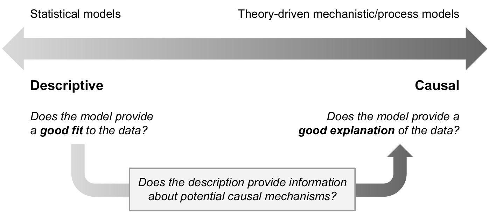

```{r setup, include=FALSE}
knitr::opts_chunk$set(echo = FALSE)

library(tidyverse)

set.seed(12222)

n_subj <- 3
n_trial <- 20

d_prime <- c(0, 1, 2)
crit <- c(0, -0.25, 0.25)

p_hit <- pnorm(crit, mean = 0.5 * d_prime, sd = 1, lower.tail = FALSE)
p_fa <- pnorm(crit, mean = -0.5 * d_prime, sd = 1, lower.tail = FALSE)

recog_data <- c()

for (s in 1:n_subj) {
    n_hit <- round(p_hit[s] * n_trial)
    n_fa <- round(p_fa[s] * n_trial)
    
    recog_data <- rbind(
        recog_data,
        tibble(subject = s, item = "Target", resp = rep(c("Yes", "No"), c(n_hit, n_trial - n_hit))),
        tibble(subject = s, item = "Foil", resp = rep(c("Yes", "No"), c(n_fa, n_trial - n_fa)))
    )
}
```

## Outline

1. Example: Recognition Memory
2. Essence of Bayesian Data Analysis
3. Types and Goals of Modeling
4. Steps of Bayesian Data Analysis

## Example: Recognition Memory

In an experiment, a participant studies a list of 40 words.  In a subsequent test phase, the participant is shown 20 words that were from that list (*targets*) and 20 new words (*foils*).  The participant decides, for each word, whether it was on the list ("Yes") or not ("No").

Here is data from one participant in this experiment:

```{r echo = FALSE}
with(recog_data %>% filter(subject == 2), table(item, resp))
```

How good is this participant's memory for the words on the list?

| Possibility | Data typical of that possibility |
| ------------|--------------------------------- |
| Perfect memory | "Yes" to all targets, "No" to all foils |
| Okay memory | "Yes" to some targets, "No" to some foils |
| No memory | "Yes" equally often to targets and foils |

## Example: Recognition Memory

| Memory possibility | Bias possibility | Data typical of that possibility |
| ------------|------------|--------------------- |
| Perfect | Liberal | "Yes" to all targets, "No" to all foils |
| Perfect | Unbiased | "Yes" to all targets, "No" to all foils |
| Perfect | Conservative | "Yes" to all targets, "No" to all foils |
| Okay | Liberal | "Yes" to most targets, "No" to few foils |
| Okay | Unbiased | "Yes" to some targets, "No" to some foils |
| Okay | Conservative | "Yes" to few targets, "No" to most foils |
| None | Liberal | Many "Yes"'s equally often to targets and foils |
| None | Unbiased | Equal number of "Yes" and "No" equally often to targets and foils |
| None | Conservative | Many "No"'s equally often to targets and foils |

## Example: Recognition Memory

There are *many* different possible ways to characterize this participant, and there are at least two factors we need to take into account to do so: memory quality and decision bias.  Equivalently, we can describe these as an *intercept* (average probability of saying "Yes"; bias) and *slope* (difference in probability of saying "Yes" between targets and foils; memory quality).

These two factors correspond to **parameters** in a **model**.  Different models realize these parameters in different ways and place different restrictions on their values.  If $i$ is a trial index, here are some common types of model that could be applied to these data that specify the *probability* $\theta_{\text{Yes}}[i]$ of making a "yes" response on trial $i$, depending on whether the item on trial $i$ is a target ($\text{Target}[i] = 1$) or not ($\text{Target}[i] = 0$):

* *Threshold model:* $\theta_{\text{Yes}}[i] = \gamma + (1 - \gamma) \times \delta \times \text{Target}[i]$; $0 \leq g \leq 1$, $0 \leq d \leq 1$
* *"Probit" regression model:* $\theta_{\text{Yes}}[i] = \Phi \left( \beta_0 + \beta_1 \times \text{Target}[i] \right)$; $\beta_0, \beta_1 \in \left( -\infty, \infty \right)$
* *Signal detection model:* $\theta_{\text{Yes}}[i] = \Phi \left(\delta \times \text{Target}[i] - \kappa \right)$; $\kappa, \delta \in \left( -\infty, \infty \right)$

Notice that the "probit" regression and signal detection model are largely identical!

## Example: Recognition Memory

The models on the last slide only specified the *probability* of making a "Yes" response on trial $i$.  What we actually observe is binary ("yes" or "no").  The probability---and the parameters that specify that probability for each trial---is *latent*, in contrast to the data we directly *observed*.

The probability $\theta_{\text{Yes}}[i]$ gives the *likelihood* of the outcome we did observe, which we will denote $y[i]$ (which equals "Yes" or "No"):
$$
p(y[i]) = \begin{cases}
    \theta_{\text{Yes}}[i] & \text{if } y[i] = \text{"Yes"} \\
    1 - \theta_{\text{Yes}}[i] & \text{if } y[i] = \text{"No"} \\
    \end{cases}
$$

Recall that probabilities of conjunctions of independent events multiply.  Assuming that each trial is independent (*Which is common but certainly not correct!*), the total likelihood across all trials ($\mathbf{x}$) is the *product* of the likelihoods for each individual trial:

$$
p(\mathbf{x}) = \prod_{i = 1}^{\text{Num. trials}} p(y[i])
$$

## Example: Recognition Memory

We now have a chain of dependencies that looks something like this:

$$
\text{Parameters} \rightarrow \text{Likelihood} \rightarrow \text{Observation}
$$

Given a *model*, we can say how *likely* any particular set of *observations* are, given a choice of values for the model's *parameters*.  This is a **generative model** because it describes a *process that generates data*.

**Bayesian inference** reverses this chain: What values of model parameters assign sufficiently high likelihood to the observed data to remain credible?

Since model parameters represent *meaningful statements* about what is *possible*, **Bayesian inference is reallocating credibility across possibilities**.

## Example: Recognition Memory

For example, we can look at the likelihood of a set of data for different values of the memory quality parameter $\delta$ from the signal detection model ($\theta_{\text{Yes}}[i] = \Phi \left(\delta \times \text{Target}[i] - \kappa \right)$) (*we are ignoring the decision bias parameter $\kappa$ for simplicity*).

```{r}
n_par <- 101

params <- expand_grid(
        kappa = seq(-3, 3, length.out = n_par),
        delta = seq(-1, 3, length.out = n_par)
    )

sidebarLayout(
    sidebarPanel(
        numericInput("n_hit", 'Num. "yes" to targets', 15),
        numericInput("n_miss", 'Num. "no" to targets', 5),
        numericInput("n_fa", 'Num. "yes" to foils', 8),
        numericInput("n_cr", 'Num. "no" to foils', 12),
        width = 3
    ),
    mainPanel(
        renderPlot({
            print(
                params %>%
                    mutate(
                        l = dbinom(input$n_hit, input$n_hit + input$n_miss, prob = pnorm(kappa + 0.5 * delta)) * dbinom(input$n_fa, input$n_fa + input$n_cr, prob = pnorm(kappa - 0.5 * delta))
                    ) %>%
                    group_by(delta) %>%
                    summarize(l = mean(l)) %>%
                    ggplot(aes(x = delta, y = l)) +
                    geom_area(fill = "#00000044", color = "black") +
                    labs(x = "Delta (memory quality parameter)", y = "Likelihood of data given delta") +
                    coord_cartesian(ylim = c(0, dbinom(input$n_hit, input$n_hit + input$n_miss, prob = input$n_hit / (input$n_hit + input$n_miss)) * dbinom(input$n_fa, input$n_fa + input$n_cr, prob = input$n_fa / (input$n_fa + input$n_cr))))
            )
        }),
        width=7
    )
)
```

## Example: Recognition Memory

When we have *prior information* about the relative credibility of parameter values, the **posterior credibility** is a function of *both* prior and likelihood, as defined by **Bayes' theorem**.

```{r}
n_par <- 101

params <- expand_grid(
        kappa = seq(-3, 3, length.out = n_par),
        delta = seq(-1, 3, length.out = n_par)
    )

sidebarLayout(
    sidebarPanel(
        numericInput("n_hit2", 'Num. "yes" to targets', 15),
        numericInput("n_miss2", 'Num. "no" to targets', 5),
        numericInput("n_fa2", 'Num. "yes" to foils', 8),
        numericInput("n_cr2", 'Num. "no" to foils', 12),
        sliderInput("delta_prior_mean", "Prior mean for 'delta'", min = -1, max = 3, value = 1, step = 0.1),
        sliderInput("delta_prior_sd", "Prior std. dev. for 'delta'", min = 0, max = 10, value = 1, step = 0.1),
        width = 4
    ),
    mainPanel(
        renderPlot({
            print(
                params %>%
                    mutate(likelihood = dbinom(input$n_hit2, input$n_hit2 + input$n_miss2, prob = pnorm(kappa + 0.5 * delta)) * dbinom(input$n_fa2, input$n_fa2 + input$n_cr2, prob = pnorm(kappa - 0.5 * delta))) %>%
                    group_by(delta) %>%
                    summarize(likelihood = mean(likelihood)) %>%
                    mutate(
                        prior = dnorm(delta, mean = input$delta_prior_mean, sd = input$delta_prior_sd),
                        post = prior * likelihood
                    ) %>%
                    mutate(prior = prior / sum(prior), likelihood = likelihood / sum(likelihood), post = post / sum(post)) %>%
                    pivot_longer(c(prior, likelihood, post), names_to = "type", values_to = "credibility") %>%
                    mutate(type = factor(type, levels = c("prior", "likelihood", "post"))) %>%
                    ggplot(aes(x = delta, y = credibility, color = type, fill = type)) +
                    geom_area(alpha = 0.5, position = "identity") +
                    labs(x = "Delta (memory quality parameter)", y = "Relative credibility of delta value given data", color = NULL, fill = NULL)
            )
        }),
        width=7
    )
)
```

## Example: Recognition Memory

Bayesian inference yields a **posterior distribution** that represents the *relative credibility* of parameter values in light of the data.  We can use this distribution to address questions like:

* What is the probability that $\delta > 0$? (i.e., that the participant has non-negligible memory)
* What is the probability that $\delta = 0$ or is within a small region around 0? (i.e., that there is an "effect" on recognition performance of having studied a word)

But this is all about just one participant, what if we have many?

## Example: Recognition Memory

We can extend our model to specify how individual participants are related to the whole group.  For example, the $\delta$ and $\kappa$ parameters for each participant might be normally distributed among the whole group.  The group is then described by parameters for the means ($\mu_{\delta}$, $\mu_{\kappa}$) and standard deviations ($\sigma_{\delta}$, $\sigma_{\kappa}$) of those normal distributions.

$$
\text{Group parameters} \rightarrow \begin{cases}
    \text{Participant params.} \rightarrow \text{Likelihood} \rightarrow \text{Observations} & \text{participant 1} \\
    \text{Participant params.} \rightarrow \text{Likelihood} \rightarrow \text{Observations} & \text{participant 2} \\
    \vdots & \vdots \\
    \text{Participant params.} \rightarrow \text{Likelihood} \rightarrow \text{Observations} & \text{participant }N
    \end{cases}
$$

This is a **hierarchical model**.  We can use it to answer questions like

* What is the probability that participants on average show some memory ($\mu_{\delta} > 0$)?
* What is the distribution of memory performance that we would expect to see *from a new participant drawn from the same group*?
* If there are multiple groups (e.g., Alzheimer's patients and age- and IQ-matched controls), we can find the probability that their average memory quality differs (or the probability that one group is more variable than another).
* We can also incorporate an item-level hierarchy (e.g., performance on a trial depends both on the participant *and* the word shown on that trial).

## Example: Recognition Memory

```{r echo = FALSE, out.width = "20%"}

```

We can address these questions *while also asking questions about individual participants*!  We can also ask about *ad hoc* contrasts.  E.g., participants 1--5 were run in one room while participants 6--13 were run in another; is there a difference in average memory quality between these *ad hoc* groups?

In Bayesian data analysis, all inference is based on the **joint posterior distribution for all model parameters**.  The posterior distribution gives a **complete description** of the relative credibility of different (combinations of) parameter values within a model.

This is in contrast to frequentist analysis, which can only test one parameter at a time and is based on the notion of "sampling distributions".  Sampling distributions describe parameter values that arise from the *future intentions of the researcher*.  The posterior distribution describes *what the researcher learned about parameter values from data they actually got*.

## The Essence of Bayesian Data Analysis

1. Different possibilities about how observable data could arise are represented by different values of parameters in a model.
2. Inference involves using observed data to re-allocate credibility among those possibilities.

## Holmesian deduction

```{r echo = FALSE, out.height = "70%"}

```

## Judicial exoneration

```{r echo = FALSE, out.height = "70%"}

```

## Models

The parameters in a model do not need to correspond to specific causal mechanisms (like memory quality and decision bias).  They may instead correspond to particular aspects of the data (like average probability of saying "yes" and effect on saying "yes" of whether a word was studied).

Even models that are *formally* identical can sometimes have parameters that can interpreted in a *descriptive* sense or in a *causal* sense.

* **Descriptive** model: $\theta_{\text{Yes}}[i] = \Phi \left( \beta_0 + \beta_1 \times \text{Target}[i] \right)$; $\beta_0, \beta_1 \in \left( -\infty, \infty \right)$
* **Causal** model: $\theta_{\text{Yes}}[i] = \Phi \left(\delta \times \text{Target}[i] - \kappa \right)$; $\kappa, \delta \in \left( -\infty, \infty \right)$

```{r echo = FALSE, out.width = "60%"}

```

## Meaningful Parameters

Although most of the models we will learn about in this course are meant to be interpreted in a *descriptive* sense, the models are still intended to *help us learn*.  This entails satisfying two goals:

* The model should be able to generate predicted data that look like the data we actually observe (i.e., the model "fits").
* The parameters of the model should be *meaningful* with respect to the scientific inferences we wish to draw.

## Steps of Bayesian Data Analysis

1. Identify the data relevant to the research questions. What are the measurement scales of the data? Which data variables are to be predicted, and which data variables are supposed to act as predictors?
2. Define a descriptive model for the relevant data. The mathematical form and its parameters should be meaningful and appropriate to the theoretical purposes of the analysis.
3. Specify a prior distribution on the parameters. The prior must pass muster with the audience of the analysis, such as skeptical scientists.
4. Use Bayesian inference to re-allocate credibility across parameter values. Interpret the posterior distribution with respect to theoretically meaningful issues (assuming that the model is a reasonable description of the data; see next step).
5. Check that the posterior predictions mimic the data with reasonable accuracy (i.e., conduct a "posterior predictive check"). If not, then consider a different descriptive model.

## Particularly Powerful Applications of Bayesian Statistics

* Understanding individual and group differences
* Understanding joint influences of participants and materials
* Estimation when data is sparse
* When the goal is *understanding* in a holistic sense, rather than rejection of hypotheses