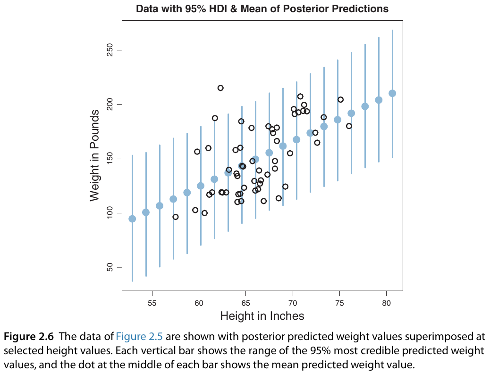

```{r setup, include=FALSE}
knitr::opts_chunk$set(echo = FALSE)

library(tidyverse)

set.seed(12222)
```

## Outline

1. Posterior predictive check
2. Exercise discussion
3. Working with R

## Steps of Bayesian Data Analysis

1. Identify the data relevant to the research questions. What are the measurement scales of the data? Which data variables are to be predicted, and which data variables are supposed to act as predictors?
2. Define a descriptive model for the relevant data. The mathematical form and its parameters should be meaningful and appropriate to the theoretical purposes of the analysis.
3. Specify a prior distribution on the parameters. The prior must pass muster with the audience of the analysis, such as skeptical scientists.
4. Use Bayesian inference to re-allocate credibility across parameter values. Interpret the posterior distribution with respect to theoretically meaningful issues (assuming that the model is a reasonable description of the data; see next step).
5. Check that the posterior predictions mimic the data with reasonable accuracy (i.e., conduct a **posterior predictive check**). If not, then consider a different descriptive model.

The above is quoted from the book, but I have a minor quibble with the phrasing of step 4:  The models we work with are **generative models**, so they actually do *not* provide a "description of the data".  They provide a description of the *processes that generate data*.  So the goal of a posterior predictive check is to see whether the model provides a sufficiently reasonable description of the processes that generate data *in the sense that* it produces data that look like the data that are actually observed.

## Does the model pass the posterior predictive check?

$\text{Weight} \sim \text{Normal with mean } \beta_0 + \beta_1 \times \text{Height; and standard deviation } \sigma$

```{r out.width = "50%"}


```

## Exercise discussion

**Exercise 2.1. [Purpose: To get you actively manipulating mathematical models of probabilities.]** Suppose we have a four-sided die from a board game. On a tetrahedral die, each face is an equilateral triangle. When you roll the die, it lands with one face down and the other three faces visible as a three-sided pyramid. The faces are numbered 1-4, with the value of the bottom face printed (as clustered dots) at the bottom edges of all three visible faces. Denote the value of the bottom face as x. Consider the following three mathematical descriptions of the probabilities of x. Model A: p(x) = 1/4. Model B: p(x) = x/10. Model C: p(x) = 12/(25x). For each model, determine the value of p(x) for each value of x. Describe in words what kind of bias (or lack of bias) is expressed by each model.

**Exercise 2.2. [Purpose: To get you actively thinking about how data cause credibilities to shift.]** Suppose we have the tetrahedral die introduced in the previous exercise, along with the three candidate models of the die’s probabilities. Suppose that initially, we are not sure what to believe about the die. On the one hand, the die might be fair, with each face landing with the same probability. On the other hand, the die might be biased, with the faces that have more dots landing down more often (because the dots are created by embedding heavy jewels in the die, so that the sides with more dots are more likely to land on the bottom). On yet another hand, the die might be biased such that more dots on a face make it less likely to land down (because maybe the dots are bouncy rubber or protrude from the surface). So, initially, our beliefs about the three models can be described as p(A) = p(B) = p(C) = 1/3. Now we roll the die 100 times and find these results: #1’s = 25, #2’s = 25, #3’s = 25, #4’s = 25. Do these data change our beliefs about the models? Which model now seems most likely? Suppose when we rolled the die 100 times we found these results: #1’s = 48, #2’s = 24, #3’s = 16, #4’s = 12. Now which model seems most likely?

## To `tidy` or not to `tidy`?

One of the biggest innovations to come to R is the `tidyverse`, a set of R packages that streamline data manipulation, analysis, and presentation relative to "base R".

While the `tidyverse` makes a lot of otherwise complex tasks easier, it also---by design---obscures a lot of the underlying machinery that goes into performing those tasks.

Although we will make use of the `tidyverse` later in this course, for now we will work primarily in "base R".  This is because one of the themes of the course is the importance of building bespoke statistical models that grant insight into your specific research questions, rather than having to rely on off-the-shelf methods.  Building those models requires some degree of comfort with the programming concepts that the `tidyverse` helpfully handles for you.

Think of the `tidyverse` as like a box of Legos---you can build things quickly, but you are limited by the pieces available.  "Base R" is like a workshop outfitted with an array of tools---it takes longer to make things, but you can make them exactly to your specifications.

You will still find yourself in situations where the Legos will do exactly what you want!  So even if you end up mostly using the `tidyverse`, learning about "base R" first helps you understand *why* and *how* the Legos are working to help you build the models you want.

## Setting the Stage

As noted on the book website, there is more stuff that we'll eventually need to install for material later in the course.  For now, though, these three steps are all we need to follow.

*If you are on a campus computer, R and RStudio will already be installed, so you can skip to step 3.*

1. Install R: [https://cran.r-project.org/](https://cran.r-project.org/)
2. Install RStudio: [https://www.rstudio.com/products/rstudio/](https://www.rstudio.com/products/rstudio/)
3. Download and extract the book resources (the ZIP file at the bottom of this page): [https://sites.google.com/site/doingbayesiandataanalysis/software-installation](https://sites.google.com/site/doingbayesiandataanalysis/software-installation)
4. Start RStudio and use the "Files" pane to navigate to the directory where you extracted the book resources.
5. Open the file `SimpleGraph.R`.
6. **Set the working directory** to the same directory in which `SimpleGraph.R` resides.

## Working with R

The file `ExamplesOfR.R` in the book is a great resource!

1. Adapt the program `SimpleGraph.R` to plot a cubic function ($y = x^3$) over the interval $x \in [-3, +3]$. Save the graph as a PDF file.
2. Getting help
3. Vectors, operations, and indexing
4. Data frames
5. Reading data from files
6. Conditions and loops