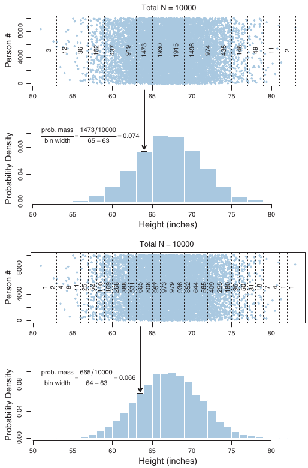
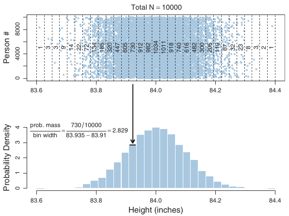
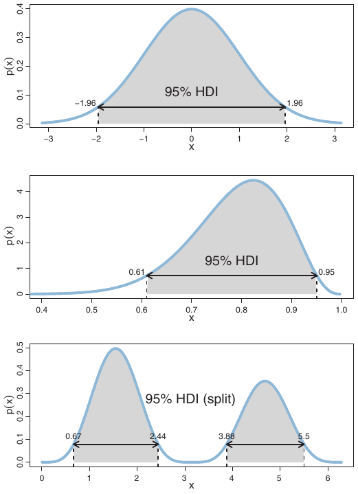

```{r setup, include=FALSE}
knitr::opts_chunk$set(echo = FALSE)

library(tidyverse)

set.seed(12222)
```

## Sample space

The **sample space** represents all possible outcomes that we could observe in a particular measurement context.

* *Coin flip:* $\left\lbrace \text{Heads, Tails} \right\rbrace$
* *Yes/no question:* $\left\lbrace \text{Yes, No} \right\rbrace$
* *Visual search:* $\left\lbrace \text{Target absent, Target present} \right\rbrace$
* *Survey question:* $\left\lbrace \text{Strongly disagree, disagree, neutral, agree, strongly agree} \right\rbrace$
* *Response time:* In principle, $\left[ 0, \infty \right)$, but really $\left[ 0, \text{maximum RT} \right]$

Note that these example sample spaces correspond to *single events*, like a single flip, single survey item, or single experimental trial.  We aren't talking about sample spaces for data summaries like means, variances, etc.  We are talking about sample spaces *for the things we immediately observe*.

This also highlights why so many of our examples involve coin flips:  Coin flips can stand in for the many things we *do* measure that have binary outcomes (yes/no, accept/reject, agree/disagree, same/different, present/absent, etc.).

## The rules of probability

Once we have specified our sample space, we can talk about the *probability* with which we expect any one outcome from that space to occur during each measurement event.  For each possible outcome $x$, there is a probability $p(x)$ that $x$ occurs.

Probabilities can be *interpreted* in many ways, but anything with the name "probability" has to satisfy three properties:

1. All probabilities must be nonnegative ($p(x) \geq 0$ for all $x$ in the sample space).
2. The sum of probabilities across all elements of the sample space is one ($\sum_{x} p(x) = 1$).  Whenever you make a measurement, *something* has to happen (if the sum is less than one, that tells you your sample space does *not* cover all possible outcomes).
3. For any two mutually exclusive outcomes, the probability that one or the other of them occurs is the sum of their individual probabilities ($p(x_1 \text{ or } x_2) = p(x_1) + p(x_2)$ for all $x_1$, $x_2$ in the sample space).

## Interpreting probabilities

Probabilities can be interpreted in different ways, even though they are treated the same mathematically.

A *frequentist* interpretation views probabilities as describing the *long-run relative frequency* with which different outcomes are observed.  If you could repeat a measurement an infinite number of times, the relative frequency with which each outcome $x$ occurred is the probability $p(x)$.

A *subjective* interpretation views probabilities as describing our *degree of belief* that each outcome will occur on a given measurement.

In the frequentist interpretation, the probability is a post-hoc description that *emerges* from a long run of (imagined) measurements.  In the subjective interpretation, the probability is a description of our expectations/uncertainty based on what we know at the time.

In neither interpretation are probabilities "real things" separate from us as observers, so in a sense both involve subjectivity.  Moreover, degrees of belief are influenced by observation, so observing many outcomes should lead us to assign credibility to outcomes that matches their relative frequency.

## Probabilities and long-run frequency

```{r}
sidebarLayout(
    sidebarPanel(
        numericInput("N", 'Total number of flips', 500),
        sliderInput("pHeads", 'Probability of "heads"', min = 0, max = 1, step = 0.01, value = 0.5),
        width = 3
    ),
    mainPanel(
        renderPlot({
            # Flip a coin N times and compute the running proportion of heads at each flip.
            # Generate a random sample of N flips (heads=1, tails=0):
            flipSequence = sample( x=c(0,1), prob=c(1-input$pHeads,input$pHeads), size=input$N, replace=TRUE )
            # Compute the running proportion of heads:
            r = cumsum( flipSequence ) # Cumulative sum: Number of heads at each step.
            n = 1:input$N                    # Number of flips at each step.
            runProp = r / n            # Component by component division.
            # Graph the running proportion:
            plot( n , runProp , type="o" , log="x" , col="skyblue" ,
                  xlim=c(1,input$N) , ylim=c(0.0,1.0) , cex.axis=1.5 ,
                  xlab="Flip Number" , ylab="Proportion Heads" , cex.lab=1.5 ,
                  main="Running Proportion of Heads" , cex.main=1.5 )
            # Plot a dotted horizontal reference line:
            abline( h=input$pHeads , lty="dotted" )
            # Display the beginning of the flip sequence:
            flipLetters = paste( c("T","H")[flipSequence[1:10]+1] , collapse="" )
            displayString = paste0( "Flip Sequence = " , flipLetters , "..." )
            text( input$N , .9 , displayString , adj=c(1,0.5) , cex=1.3 )
            # Display the relative frequency at the end of the sequence.
            text( input$N , .8 , paste("End Proportion =",runProp[input$N]) , adj=c(1,0.5) , cex=1.3 )
        }),
        width=7
    )
)
```

## Probabilities without repetition

When we cannot repeat a measurement many times, it becomes a bit silly to think about its long-run relative frequency.

* What is the probability that the US finds weapons of mass destruction in Iraq?
* What is the probability that Donald Trump wins the 2016 US presidential election?
* What is the probability that patient JH goes into relapse next week?
* What is the probability that a participant correctly detects a target object on trial 33 of a visual search task?

The first two examples are of events that *never repeat*.  There was a time before them, at which point we were uncertain about the outcome, and a time after them, at which point we knew how things had turned out.  What would it mean to "repeat" these events?  How could they ever turn out differently than they did?

The third example illustrates how non-repeatable events happen in research and applied settings all the time.  The fourth example illustrate how even in experiments with multiple trials per condition, nothing ever exactly repeats.

In these cases, it makes much more sense to think about probabilities as describing degrees of belief distributed across possible outcomes.

## Eliciting subjective beliefs

To do this, we can imagine different kinds of bets and ask whether we would be willing to take them.

1. \$100 if patient JH goes into relapse next week vs. \$100 if a 20-sided die comes up 11 or more ($p = 0.5$).
2. \$100 if patient JH goes into relapse next week vs. \$100 if a 20-sided die comes up 16 or more ($p = 0.25$).
3. \$100 if patient JH goes into relapse next week vs. \$100 if a 20-sided die comes up 6 or more ($p = 0.75$).

The probability for which you are *indifferent* between the two bets is your subjective belief in the likelihood of a particular outcome.

## Probability distributions

When there is a finite number of outcomes in our sample space, we can list each outcome along with its associated probability.  This list is a *probability distribution*.

| Outcome | Probability |
|---------|-------------|
| Heads   | $\theta = 0.55$ |
| Tails   | $1 - \theta = 0.45$ |

For discrete outcomes, we speak of the **probability mass** that is assigned to each outcome.  It is literally the *weight* assigned to that outcome.

## Probability density

<div class="columns-2">
```{r echo = FALSE, out.width = "75%"}

```

When the sample space consists of *continuous* outcomes, we could "bin" the outcomes into discrete intervals and assign mass to those, but this depends on the arbitrary choice of interval width.

Instead, we imagine taking infinitesimally small slides of the sample space and assigning them a probability *density*.

Densities can be larger than one.

```{r echo = FALSE, out.width = "75%"}

```
</div>

## Densities *integrate* to one

Why does this not violate the rule that probabilities have to add to one across the sample space?

$$
\begin{align}
\sum_i p\left( \left[ x_i, x_i + \Delta x \right] \right) = 1 & \qquad \begin{matrix} \text{Probability mass across all intervals} \\ \text{of width } \Delta x \text{ must add up to 1} \end{matrix} \\
\sum_i \Delta x \frac{p\left( \left[ x_i, x_i + \delta x \right] \right)}{\Delta x} = 1 & \qquad \text{Densities are mass divided by volume/width} \\
\underbrace{\sum_i}_{\int} \underbrace{\Delta x}_{dx} \underbrace{\frac{p\left( \left[ x_i, x_i + \delta x \right] \right)}{\Delta x}}_{p(x)} = 1 & \qquad \text{Change of notation as } \Delta x \text{ approaches } \frac{1}{\infty} \\
\int dx \; p(x) = 1 & \qquad \text{Probability density integrates to one}
\end{align}
$$

## Mathematical functions for probability densities

Because it is impossible to separately specify the probability density at each point in a continuous sample space, we typically use *mathematical functions* to specify probability density.

The *normal distribution* is one such function: $p(x) = \frac{1}{\sigma \sqrt{2 \pi}} \exp \left[ - \frac{1}{2} \left(\frac{x - \mu}{\sigma} \right)^2 \right]$

```{r}
df <- tibble(x = seq(-4, 4, length.out=201))

sidebarLayout(
    sidebarPanel(
        sliderInput("mu", 'Mean', min = -4, max = 4, step = 0.1, value = 0),
        sliderInput("sigma", 'Standard deviation', min = 0, max = 4, step = 0.1, value = 1),
        width = 3
    ),
    mainPanel(
        renderPlot({
            print(
                df %>%
                    mutate(p = dnorm(x, mean = input$mu, sd = input$sigma)) %>%
                    ggplot(aes(x = x, y = p)) +
                    geom_area(color = "black", fill = "#00000033") +
                    labs(x = "x", y = "p(x)")
            )
        }),
        width=7
    )
)
```

## Great Expectations: Mean of discrete distribution

If the sample space is numerical, then we can use a probability distribution to find the *mean* outcome, otherwise known as the *expected value* of the outcome.

The mean is the sum of the outcomes in the sample space, weighted by their probability.  Take one of the weighted 4-sided die from last week's exercise ($p(x) = x / 10$).

| Outcome | Probability | Outcome weighted by probability |
|---------|-------------|---------------------------------|
| 1       | 1 / 10      | 0.1                             |
| 2       | 2 / 10      | 0.4                             |
| 3       | 3 / 10      | 0.9                             |
| 4       | 4 / 10      | 1.6                             |

$$
E[x] = \sum_i p \left( x_i \right) x_i = 0.1 + 0.4 + 0.9 + 1.6 = 3
$$

## Great Expectations: Mean of continuous distribution

The concept of the mean remains the same, except that we replace discrete summation ($\sum_i$) with continuous integration ($\int$): $E[x] = \int dx \, p(x) x$

<div class="columns-2">

$$
p(x) = 6 x (1 - x)
$$

```{r out.width = "100%"}
tibble(x = seq(0, 1, length.out = 101)) %>%
    mutate(p = 6 * x * (1 - x)) %>%
    ggplot(aes(x = x, y = p)) +
    geom_area(color = "black", fill = "#00000033") +
    labs(x = "x", y = "p(x)")
```

$$
\begin{align}
E[x] & = \int_0^1 dx \; 6x (1 - x) \; x = \int_0^1 dx \; 6x^2 - 6x^3 \\
 & = \left[ 2 x^3 - \frac{3}{2} x^4 \right]_{x = 0}^1 \\
 & = 2 (1)^3 - \frac{3}{2} (1)^4 - \left[2 (0)^3 - \frac{3}{2} (0)^4 \right] \\
 & = 2 - \frac{3}{2} \\
 & = \frac{1}{2}
\end{align}
$$
</div>

## Great Expectations: Variance

The variance is the expected squared deviation from the mean, i.e., the sum of all squared deviations weighted by their probability.  The square root of the variance gives the *standard deviation*.

<div class="columns-2">

$$
p(x) = 6 x (1 - x)
$$

```{r out.width = "100%"}
tibble(x = seq(0, 1, length.out = 101)) %>%
    mutate(p = 6 * x * (1 - x)) %>%
    ggplot(aes(x = x, y = p)) +
    geom_area(color = "black", fill = "#00000033") +
    labs(x = "x", y = "p(x)")
```

$$
\begin{align}
\text{var}_x & = \int dx \; p(x) \, \left(x - E[x] \right)^2 \\
 & = \int_0^1 dx \; 6 x (1 - x) \, \left(x - \frac{1}{2} \right)^2 \\
 & = \int_0^1 dx \left(-6 x^4 + 12 x^3 - \frac{15}{2} x^2 + \frac{3}{2} x \right) \\
 & = \left[ -\frac{6}{5} x^5 + 3 x^4 - \frac{5}{2} x^3 + \frac{3}{4} x \right]_{x = 0}^1 \\
 & = \frac{1}{20}
\end{align}
$$
</div>

## Summarizing distributions: Intervals

It is often convenient to summarize distributions using the mean and standard deviation or variance, but there are two other important summaries we will encounter:  **credible intervals** (CI) and **highest-density intervals** (HDI).  These only apply to numerical sample spaces.

A **95% credible interval** is the interval between the 2.5th and 97.5 quantiles of the distribution.  A $p$ quantile is the value $x$ such that $\int^x p(x) = p$, i.e., the value $x$ such that the total probability of the values less than $x$ equals $p$.  Analogous CI's can be defined for different percentages.

A **95% highest-density interval** is the interval that satisfies two properties:
1. Any point $x$ within the interval has higher density than any point outside the interval.
2. The total probability within the interval equals 0.95.  (This is adjustable, same as for CI.)

## CI vs. HDI: Part 1

<div class="columns-2">
```{r fig.height=5.5, fig.width=5}
# Function that computes the HDI for a given density
whichHDI <- function(density, dx, hdiProb = 0.95) {
    # This is how the HDI is defined: in terms of which parts of the distribution have higher density than the rest
    toOptimize <- function(densCutoff) {
        whichAboveCutoff <- which(density > densCutoff)
        pInRegion <- sum(density[whichAboveCutoff] * dx)
        return(pInRegion - hdiProb)
    }
    
    # This function finds the density level at which hdiProb of the distribution has higher density than the remaining 1 - hdiProb
    bestFit <- uniroot(toOptimize, interval = range(density))
    
    return(list(densCutoff = bestFit$root, inHDI = which(density > bestFit$root)))
}

# "Alpha level"
criticalProb <- 0.95
criticalRange <- c(0.5 * (1 - criticalProb), 1 - 0.5 * (1 - criticalProb))

# Parameters of the beta distribution
alpha <- 3
beta <- 9

# This is the grid of points over which the beta density will be computed
x <- seq(0, 1, length.out=2001)
# This is the width of the bins at which the density is computed
dx <- x[2] - x[1]

# The beta density
d <- dbeta(x, shape1=alpha, shape2=beta)

# The beta CDF
p <- pbeta(x, shape1=alpha, shape2=beta)

# Which of these points are in the HDI?
HDI <- whichHDI(d, dx, hdiProb = criticalProb)

# Which of these points are in the credible interval?
inCI <- which(p > criticalRange[1] & p <= criticalRange[2])

median <- qbeta(0.5, alpha, beta)

par(mfcol = c(3, 1), mar = c(4, 4, 2, 2) + 0.1)

plot(x, d, type='l', lwd=1, xlab='x', ylab='Density', main='Computing the Credible Interval')
segments(qbeta(c(criticalRange[1], 0.5, criticalRange[2]), alpha, beta), rep(0, 3), qbeta(c(criticalRange[1], 0.5, criticalRange[2]), alpha, beta), rep(max(d), 3), col='blue', lty=c(2, 1, 2), lwd=1)
arrows(c(median - 0.05, median + 0.05), c(max(d) / 2, max(d) / 2), c(qbeta(criticalRange[1], alpha, beta) + 0.05, qbeta(criticalRange[2], alpha, beta) - 0.05), c(max(d) / 2, max(d) / 2), col='blue')
points(x[inCI], rep(0, length(inCI)), col='blue', pch=15)

plot(x, d, type='l', lwd=1, xlab='x', ylab='Density', main='Computing the Highest Density Interval')
points(x[HDI$inHDI], rep(max(d), length(HDI$inHDI)), col='red', pch=15)
arrows(x[which.max(d)], max(d) - 0.2, x[which.max(d)], HDI$densCutoff + 0.2, col='red')
points(x[HDI$inHDI], rep(HDI$densCutoff, length(HDI$inHDI)), col='red', pch=15)

plot(x, d, type='l', lwd=1, xlab='x', ylab='Density', main='Comparing CI and HDI')
points(x[HDI$inHDI], rep(HDI$densCutoff, length(HDI$inHDI)), col='red', pch=15)
points(x[inCI], rep(0, length(inCI)), col='blue', pch=15)
legend('topright', legend=c('Density', 'HDI', 'CI'), lty=1, col=c('black', 'red', 'blue'), lwd=c(1, 2, 2))
```

You can think of the credible interval as like "opening the curtains".  You open the curtains just wide enough to encompass the middle 95% of the distribution.

The HDI is like "lowering the blinds".  You lower the blinds just enough to hide the 95% most probable values.

Note that while the CI by definition has equal probability in the tails, the HDI does not.

</div>

## CI vs. HDI: Part 2

<div class="columns-2">
```{r fig.height=5.5, fig.width=5}
# Function that computes the HDI for a given density
whichHDI <- function(density, dx, hdiProb = 0.95) {
    # This is how the HDI is defined: in terms of which parts of the distribution have higher density than the rest
    toOptimize <- function(densCutoff) {
        whichAboveCutoff <- which(density > densCutoff)
        pInRegion <- sum(density[whichAboveCutoff] * dx)
        return(pInRegion - hdiProb)
    }
    
    # This function finds the density level at which hdiProb of the distribution has higher density than the remaining 1 - hdiProb
    bestFit <- uniroot(toOptimize, interval = range(density))
    
    return(list(densCutoff = bestFit$root, inHDI = which(density > bestFit$root)))
}

# "Alpha level"
criticalProb <- 0.95
criticalRange <- c(0.5 * (1 - criticalProb), 1 - 0.5 * (1 - criticalProb))

# Parameters of the beta distribution
alpha <- 0.8
beta <- 0.8

# This is the grid of points over which the beta density will be computed
x <- seq(0, 1, length.out=2001)
x <- 0.5 * (x[2:length(x)] + x[1:(length(x) - 1)])
# This is the width of the bins at which the density is computed
dx <- x[2] - x[1]

# The beta density
d <- dbeta(x, shape1=alpha, shape2=beta)

# The beta CDF
p <- pbeta(x, shape1=alpha, shape2=beta)

# Which of these points are in the HDI?
HDI <- whichHDI(d, dx, hdiProb = criticalProb)

# Which of these points are in the credible interval?
inCI <- which(p > criticalRange[1] & p <= criticalRange[2])

median <- qbeta(0.5, alpha, beta)

par(mfcol = c(3, 1), mar = c(4, 4, 2, 2) + 0.1)

plot(x, d, type='l', lwd=1, xlab='x', ylab='Density', main='Computing the Credible Interval', ylim = c(0, max(d)))
segments(qbeta(c(criticalRange[1], 0.5, criticalRange[2]), alpha, beta), rep(0, 3), qbeta(c(criticalRange[1], 0.5, criticalRange[2]), alpha, beta), rep(max(d), 3), col='blue', lty=c(2, 1, 2), lwd=1)
arrows(c(median - 0.05, median + 0.05), c(max(d) / 2, max(d) / 2), c(qbeta(criticalRange[1], alpha, beta) + 0.05, qbeta(criticalRange[2], alpha, beta) - 0.05), c(max(d) / 2, max(d) / 2), col='blue')
points(x[inCI], rep(0, length(inCI)), col='blue', pch=15)

plot(x, d, type='l', lwd=1, xlab='x', ylab='Density', main='Computing the Highest Density Interval', ylim = c(0, max(d)))
points(x[HDI$inHDI], rep(max(d), length(HDI$inHDI)), col='red', pch=15)
arrows(x[which.max(d)], max(d) - 0.2, x[which.max(d)], HDI$densCutoff + 0.2, col='red')
points(x[HDI$inHDI], rep(HDI$densCutoff, length(HDI$inHDI)), col='red', pch=15)

plot(x, d, type='l', lwd=1, xlab='x', ylab='Density', main='Comparing CI and HDI', ylim = c(0, max(d)))
points(x[HDI$inHDI], rep(HDI$densCutoff, length(HDI$inHDI)), col='red', pch=15)
points(x[inCI], rep(0, length(inCI)), col='blue', pch=15)
legend('topright', legend=c('Density', 'HDI', 'CI'), lty=1, col=c('black', 'red', 'blue'), lwd=c(1, 2, 2))
```

For distributions with multiple modes, the CI often does not do a good job summarizing the values with highest probability.

</div>

## HDI

<div class="columns-2">
```{r out.width = "80%"}

```

The HDI can also be *non-contiguous* if the distribution has multiple modes.  We will use the 95% HDI a lot for two reasons:

1. The HDI summarizes which values have relatively high probability.  This is not always the case for the CI.
2. The *width* of the HDI is useful for summarizing our *uncertainty* when we are using probabilities to express degrees of belief.  A very wide HDI indicates that we are very uncertain about where to put our beliefs.

</div>

## Probabilities of what?

We have talked about a "sample space" in a pretty abstract sense.  When we have had examples, the sample space was generally something with physical meaning.

Notice that we often specified probabilities in terms of parameters of mathematical models ($\theta$, $\mu$, $\sigma$).  Just like we can speak of the probability that some observed variable takes a particular value, we can speak of the probability that a parameter takes a particular value.

This leap---from probabilities of observations to probabilities of parameter values---is the essence of Bayesian inference.