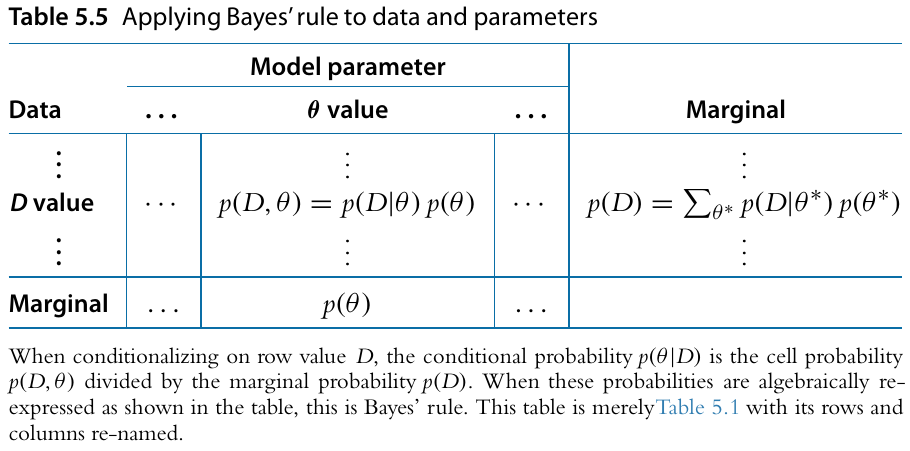

```{r setup, include=FALSE}
knitr::opts_chunk$set(echo = FALSE)

library(tidyverse)

source("DBDA2Eprograms/DBDA2E-utilities.R")
source("DBDA2Eprograms/BernGrid.R")

set.seed(12222)

joint_table <- apply(HairEyeColor, MARGIN = c(1, 2), FUN = sum)
joint_table <- joint_table / sum(joint_table)

marg_table <- cbind(rbind(joint_table, "Marginal" = colSums(joint_table)), "Marginal" = c(rowSums(joint_table), 1))
names(dimnames(marg_table)) <- names(dimnames(joint_table))

conf_levels <- c("Sure no", "Unsure no", "Guess", "Unsure yes", "Sure yes")
cond <- c("Not studied", "Studied once", "Studied twice", "Studied four times")
p_cond <- c(0.5, 1/6, 1/6, 1/6)
mu <- c(-0.75, 0.5, 1, 1.5)
sigma <- 1
crit <- qnorm(seq(0, 1, length.out = length(conf_levels) + 1), mean = 0, sd = sigma)

conf_table <- matrix(0, nrow = length(cond), ncol = length(conf_levels))

for (i in 1:nrow(conf_table)) {
    conf_table[i,] <- diff(pnorm(crit, mean = mu[i], sd = sigma)) * p_cond[i]
}

conf_table <- cbind(rbind(conf_table, "Marginal" = colSums(conf_table)), "Marginal" = c(rowSums(conf_table), 1))
dimnames(conf_table) <- list("Condition" = c(cond, "Marginal"), "Confidence rating" = c(conf_levels, "Marginal"))
```

## Two-way distributions

Sometimes, we can characterize the sample space over which probability is distributed in terms of the conjunction of two outcomes.  A distribution that describes more than one outcome is called a **joint distribution**.

For discrete/categorical variables, we can write this in terms of a "contingency table":
```{r}
print(round(joint_table, 2))
```

Each entry in the table is a probability $p(r, c)$, where $r$ stands for a particular row and $c$ for a particular column.  For example, the probability of having blue eyes and blond hair is $p(\text{Blue}, \text{Blond}) = 0.16$.

## Marginal probability

```{r}
print(round(marg_table, 2))
```

We can use the information in this table to find *marginal probabilities* of each outcomes considered alone.

Recall from our definition of probability that the $p(\text{A or B}) = p(\text{A}) + p(\text{B})$ when A and B are mutually exclusive.

Since each combination of row/column is mutually exclusive, to find the marginal probability of being in a particular row/column, we can add up the probability of all the cells in that row/column.

$$
\begin{align}
p(\text{Blond}) & = p(\text{Blond}, \text{Brown}) + p(\text{Blond}, \text{Blue}) + p(\text{Blond}, \text{Hazel}) + p(\text{Blond}, \text{Green}) \\
 & = 0.01 + 0.16 + 0.02 + 0.03 = 0.21
\end{align}
$$
More generally, $p(r) = \sum_c p(r, c)$ and, for continuous sample spaces, $p(r) = \int dc \, p(r, c)$.

## Conditional probability

```{r}
print(round(marg_table, 2))
```

The information in the table can also be used to find *conditional probabilities*.  If we learn that someone has blue eyes, what is the conditional probability that they are blond?

$$
p(\text{Blond} | \text{Blue}) = \frac{p(\text{Blond}, \text{Blue})}{p(\text{Blue})} = \frac{p(\text{Blond}, \text{Blue})}{\sum_h p(h, \text{Blue})} = \frac{0.16}{0.36} = 0.45
$$
Notice that the probability of a person being blond *given* that we know they have blue eyes is higher than the marginal probability of being blond.  We have updated our beliefs in light of new data and therefore performed Bayesian inference!

Although we describe conditional probability as "probability of A given B", B is not necessarily "given" because it happened first.  We are simply postulating a world in which B is true and asking about the probability distribution over the sample space of A in that hypothetical world.

## Independence

```{r}
print(round(marg_table, 2))
```

If two outcomes are *independent*, then knowing that one occurred should tell you nothing about the probability that the other occurred.

Formally, we can say that $x$ and $y$ are independent if $p(x | y) = p(x)$ for all possible values of $x$ and $y$ in our sample space.  We could also go the other way and say $p(y | x) = p(y)$.

From the definition of conditional probability, $p(x | y) = \frac{p(x, y)}{p(y)} = p(x)$, which we can multiply by $p(y)$ to get $p(x, y) = p(x) \, p(y)$.  We can define independence in terms of the *invariance of conditional probabilities* **or** in terms of the *product of marginal probabilities*.

Are hair color and eye color independent?

## Independence: Example

```{r}
print(round(conf_table, 2))
```

This example of a two-way distribution represents data we might observe in a recognition memory paradigm.  Different items were studied for different numbers of times and participants report their confidence that a given test item was studied.

Are confidence and number of repetitions independent?

If all we knew were the participant's confidence ratings for each item, could we learn about how many times that item had probably been studied?

## Bayes' Rule

What has come to be called "Bayes' Rule" or "Bayes' Theorem" is really just a restatement of conditional probabilities.  It describes the mathematical relationship between an initial (prior) probability distribution and how those probabilities are *reallocated* conditional on new information.

$$
\begin{align}
p(c | r) = \frac{p(c, r)}{p(r)}, \quad & p(r | c) = \frac{p(c, r)}{p(c)} \\
p(c | r) p(r) = p(c, r), \quad & p(r | c) p(c) = p(c, r) \\
p(c | r) p(r) & = p(r | c) p(c) \\
p(c | r) = \frac{p(r | c) p(c)}{p(r)}, \quad & p(r | c) = \frac{p(c | r) p(r)}{p(c)} \\
p(c | r) = \frac{p(r | c) p(c)}{\sum_{c^*} p(c^*, r)}, \quad & p(r | c) = \frac{p(c | r) p(r)}{\sum_{r^*} p(c, r^*)} \\
\boxed{p(c | r) = \frac{p(r | c) p(c)}{\sum_{c^*} p(r | c^*) p(c^*)}}, \quad & \boxed{p(r | c) = \frac{p(c | r) p(r)}{\sum_{r^*} p(c | r^*) p(r^*)}}
\end{align}
$$

## Bayes' Rule: Example

```{r}
print(round(conf_table, 2))
```

$$
\boxed{p(c | r) = \frac{p(r | c) p(c)}{\sum_{c^*} p(r | c^*) p(c^*)}}, \quad \boxed{p(r | c) = \frac{p(c | r) p(r)}{\sum_{r^*} p(c | r^*) p(r^*)}}
$$

1. What is $p(\text{"Sure yes"} | \text{"Studied once"})$?
2. What is $p(\text{"Studied once"} | \text{"Sure yes"})$?
3. What is $p(\text{studied at least once} | \text{"Sure yes"})$?

## Bayes and Laplace

```{r, out.width = "33%"}
knitr::include_graphics("images/Thomas_Bayes.gif")


```

## Parameters and Data

What turns Bayes' rule from a neat mathematical parlor trick into a valuable tool for scientific inference is this leap:  *Rows correspond to potential data values and columns correspond to potential parameter values*.

We typically denote model parameters with $\theta$ and data with $D$.

```{r out.width = "60%"}

```

Now we can use Bayes' rule to reallocate credibility regarding model parameters *given* data, that is, to *do science*.

## Learning about a parameter from data 1

Imagine we have a coin which could be of three different types:  Either it is fair (50/50), biased towards heads (75/25), or biased towards tails (25/75).

These three possibilities are represented by three different values of a *parameter* $\theta$ within a simple *model* of coin flips.  According to this model (the "Bernoulli" model), each coin flip is independent.  The probability that the coin comes up heads on any single flip is $\theta$ while the probability that it comes up tails is $1 - \theta$.

This defines the *likelihood* of each possible observed value, *given* the value of the parameter $\theta$: $p(\text{Heads} | \theta) = \theta$, $p(\text{Tails} | \theta) = 1 - \theta$.  We can make a table of these *conditional probabilities*:

```{r}
theta_vals <- c(0.25, 0.5, 0.75)
data_vals <- c("Heads", "Tails")

coin_cond_dist <- cbind(theta_vals, 1 - theta_vals)
dimnames(coin_cond_dist) <- list("Theta" = as.character(theta_vals), "Outcome" = data_vals)
print(coin_cond_dist)
```

## Learning about a parameter from data 2

But we have a problem: we can't write the full two-way table without a notion of the *marginal probability* for each possible value of $\theta$.  These values ($p(\theta)$) are our **prior beliefs** regarding each of these possibilities.

Perhaps we have reason to believe that half of coins are fair and of those that aren't, they are equally likely to be biased in favor of either heads or tails.  We can express this by specifying $p(\theta = 0.25) = 0.25$, $p(\theta = 0.5) = 0.5$, $p(\theta = 0.75) = 0.25$.

Now we can complete our two-way table:

```{r}
prior <- c(0.25, 0.5, 0.25)
theta_vals <- c(0.25, 0.5, 0.75)
data_vals <- c("Heads", "Tails")

coin_joint_dist <- cbind(theta_vals * prior, (1 - theta_vals) * prior)
coin_joint_dist <- rbind(cbind(coin_joint_dist, rowSums(coin_joint_dist)), c(colSums(coin_joint_dist), 1))
dimnames(coin_joint_dist) <- list("Theta" = c(as.character(theta_vals), "Marginal"), "Outcome" = c(data_vals, "Marginal"))

print(coin_joint_dist)
```

## Learning about a parameter from data 3

```{r}
prior <- c(0.25, 0.5, 0.25)
theta_vals <- c(0.25, 0.5, 0.75)
data_vals <- c("Heads", "Tails")

coin_joint_dist <- cbind(theta_vals * prior, (1 - theta_vals) * prior)
coin_joint_dist <- rbind(cbind(coin_joint_dist, rowSums(coin_joint_dist)), c(colSums(coin_joint_dist), 1))
dimnames(coin_joint_dist) <- list("Theta" = c(as.character(theta_vals), "Marginal"), "Outcome" = c(data_vals, "Marginal"))

print(coin_joint_dist)
```

We are now in a position to *update* our beliefs about $\theta$ in light of data.  Say we observe a "Heads".  We can then find the conditional probabilities $p(\theta | \text{Heads})$ for each value of $\theta$:

```{r}
prior <- c(0.25, 0.5, 0.25)
theta_vals <- c(0.25, 0.5, 0.75)
data_vals <- c("Heads", "Tails")

coin_post_dist <- cbind(theta_vals * prior, 0 * (1 - theta_vals) * prior)
coin_post_dist <- coin_post_dist / sum(coin_post_dist)
coin_post_dist <- rbind(cbind(coin_post_dist, rowSums(coin_post_dist)), c(colSums(coin_post_dist), 1))
dimnames(coin_post_dist) <- list("Theta" = c(as.character(theta_vals), "Marginal"), "Outcome" = c(data_vals, "Marginal"))

print(coin_post_dist)
```

**The change in the marginal probabilities of each $\theta$ value reflect reallocation of belief from prior to posterior.**

## Learning about a parameter from data 4

What if we have two coin flips?  Now the sample space for our data has four possible values for each way the two flips could turn out: HH, HT, TH, and TT.

Because each flip is independent, the conditional probability of two flips is the product of their individual probabilities.  E.g., $p(HH | \theta) = \theta^2$, $p(HT | \theta) = \theta \left(1 - \theta \right)$, etc.

Now our two-way table has more columns:

```{r}
prior <- c(0.25, 0.5, 0.25)
theta_vals <- c(0.25, 0.5, 0.75)
data_vals <- c("HH", "HT", "TH", "TT")

coin_joint_dist <- cbind(theta_vals * theta_vals * prior, theta_vals * (1 - theta_vals) * prior, theta_vals * (1 - theta_vals) * prior, (1 - theta_vals)^2 * prior)
coin_joint_dist <- rbind(cbind(coin_joint_dist, rowSums(coin_joint_dist)), c(colSums(coin_joint_dist), 1))
dimnames(coin_joint_dist) <- list("Theta" = c(as.character(theta_vals), "Marginal"), "Outcome" = c(data_vals, "Marginal"))

print(coin_joint_dist)
```

## Learning about a parameter from data 5

Now we can see what happens if we observed, say, two "Heads" instead of just one.

```{r}
prior <- c(0.25, 0.5, 0.25)
theta_vals <- c(0.25, 0.5, 0.75)
data_vals <- c("HH", "HT", "TH", "TT")

coin_joint_dist <- cbind(theta_vals * theta_vals * prior, 0 * theta_vals * (1 - theta_vals) * prior, 0 * theta_vals * (1 - theta_vals) * prior, 0 * (1 - theta_vals)^2 * prior)
coin_joint_dist <- coin_joint_dist / sum(coin_joint_dist)
coin_joint_dist <- rbind(cbind(coin_joint_dist, rowSums(coin_joint_dist)), c(colSums(coin_joint_dist), 1))
dimnames(coin_joint_dist) <- list("Theta" = c(as.character(theta_vals), "Marginal"), "Outcome" = c(data_vals, "Marginal"))

print(coin_joint_dist)
```

Notice that, with more data, more credibility has been allocated away from $p(\theta = 0.25)$ and our initial prior giving higher credibility to $\theta = 0.5$ is now "overwhelmed" by the observation of two heads, such that we now (barely) give higher credence to $\theta = 0.75$.

## Likelihood function

As the sample space for our data gets larger, it is impractical to write a table for every possible outcome.  We will instead use a mathematical function called a **likelihood function** to express what our model says about how probable each possible dataset is, given values of the model's parameters.

For a binary outcome like a coin flip, we adopt the convention that "Heads" is represented by a numerical value $y = 1$ and "Tails" by $y = 0$.  These are just labels, no numerical relationships are meant to be implied by this convention (e.g., that "Tails" means "nothing").  Then the *likelihood function* for a single observation $y$ (which might be either 0 or 1) is given by

$$
p(y | \theta) = \theta^y \left(1 - \theta \right)^{\left(1 - y \right)}
$$

## Likelihood function: Many observations

This lets us express the likelihood of any sequence of flips, no matter how long, in a compact way.  Let $\lbrace y_i \rbrace$ represent a sequence of coin flip outcomes (e.g., $\lbrace 0, 1, 1, 0, \ldots \rbrace$ corresponding to $\lbrace \text{T}, \text{H}, \text{H}, \text{T}, \ldots \rbrace$).

$$
\begin{align}
p\left( \left\lbrace y_i \right\rbrace | \theta \right) & = \prod_i p\left(y_i | \theta \right) & \text{By assumption of independence} \\
 & = \prod_i \theta^{y_i} \left(1 - \theta \right)^{\left(1 - y_i \right)} & \text{From our previous definition} \\
 & = \theta^{\sum_i y_i} \left(1 - \theta \right)^{\sum_i \left(1 - y_i \right)} & \text{From definition of multiplication} \\
 & = \theta^{\text{Number of heads}} \left(1 - \theta \right)^{\text{Number of tails}} & \text{Nice!}
\end{align}
$$

Note that we have assumed that individual observations are *independent*, *conditional on* a value of $\theta$.  This means that the order in which data were observed does not affect the final posterior distribution.

## Visualizing reallocation

```{r}
sidebarLayout(
    sidebarPanel(
        numericInput("nHeads", 'Number of heads', 1),
        numericInput("nTails", 'Number of tails', 0),
        width = 3
    ),
    mainPanel(
        renderPlot({
            Theta = c(0.25, 0.5, 0.75)
            pTheta = c(0.25, 0.5, 0.25)
            pTheta = pTheta/sum(pTheta)      # Make pTheta sum to 1.0
            Data = c(rep(0,input$nTails),rep(1,input$nHeads))      # Single flip with 1 head
            
            posterior = BernGrid( Theta, pTheta , Data , plotType="Bars" , 
                                  showCentTend="None" , showHDI=FALSE , showpD=FALSE )
        }),
        width=6
    )
)
```

* As sample size increases, the influence of the prior on the posterior is overwhelmed by the influence of the likelihood.
* As the prior is more concentrated, more data is needed to "overwhelm" the prior's influence on the posterior.

## Visualizing reallocation: Discrete to Continuous parameter space

```{r}
sidebarLayout(
    sidebarPanel(
        numericInput("nHeadsCont", 'Number of heads', 1),
        numericInput("nTailsCont", 'Number of tails', 0),
        numericInput("nTheta", "Number of possible theta values", 3),
        sliderInput("mu", "Prior mean", min = 0, max = 1, step = 0.01, value = 0.5),
        sliderInput("kappa", "Prior certainty", min = 0, max = 40, step = 1, value = 1),
        width = 3
    ),
    mainPanel(
        renderPlot({
            shape1 <- input$mu * input$kappa + 1
            shape2 <- (1 - input$mu) * input$kappa + 1
            Theta = seq(0, 1, length.out = input$nTheta + 1)
            Theta = 0.5 * (Theta[1:(length(Theta) - 1)] + Theta[2:length(Theta)])
            pTheta = dbeta(Theta, shape1, shape2)
            pTheta = pTheta/sum(pTheta)      # Make pTheta sum to 1.0
            Data = c(rep(0,input$nTailsCont),rep(1,input$nHeadsCont))      # Single flip with 1 head
            
            posterior = BernGrid( Theta, pTheta , Data , plotType="Bars" , 
                                  showCentTend="Mode" , showHDI=TRUE , showpD=FALSE )
        }),
        width=6
    )
)
```

## Anatomy of Bayes' Rule

```{r out.width = "60%"}

```

$$
\underbrace{p(\theta | D)}_{\text{Posterior}} = \underbrace{p(D | \theta)}_{\text{Likelihood}} \underbrace{p(\theta)}_{\text{Prior}} / \underbrace{p(D)}_{\text{Evidence}}
$$

The "evidence" is the probability of observing data $D$ *marginalized over* all possible values of the model parameters $\theta$.  It is also called the *marginal likelihood*:

$$
p(D) = \int d \theta^* \, p(D | \theta^*) p (\theta^*)
$$

Note that it depends on the prior distribution $p(\theta)$!  This tells us that our "model" is not just the likelihood function, but *also* the prior.

The "evidence" is the probability that the model assigns to the observed data $D$.